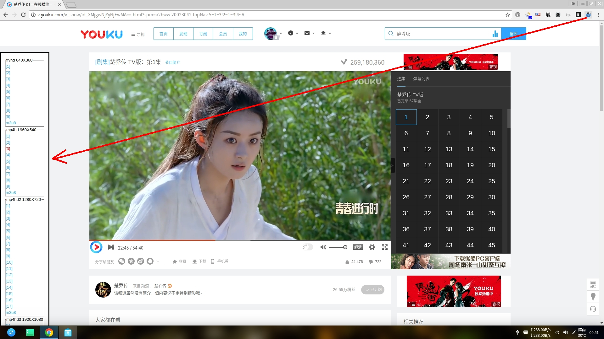

# Chrome扩展：视频抓取器
  
解析视频网页，抓取视频地址，在新标签页中播放(mp4)或者在媒体播放器中播放(flv,m3u8...)，减少Flash播放视频CPU占用高的问题，让风扇安静下来，还可以无视广告。  
致谢：视频提供商。  
参考：[YouKuDownLoader](https://github.com/zhangn1985/ykdl)。  
### 支持站点  
<table>
<tr><td>LOGO</td><td>站名</td><td>域名</td><td>支持情况</td></tr>
<tr><td></td><td>音悦Tai</td><td><a href=http://www.yinyuetai.com target=_blank>yinyuetai.com</a></td><td>mp4</td></tr>
<tr><td></td><td>优酷</td><td><a href=http://www.youku.com target=_blank>youku.com</a></td><td>flv或mp4片段列表 + m3u8(不能拖动进度)</td></tr>
<tr><td></td><td>芒果tv</td><td><a href=http://www.mgtv.com target=_blank>mgtv.com</a></td><td>m3u8(能拖动进度)</td></tr>
<tr><td></td><td>搜狐视频</td><td><a href=http://tv.sohu.com target=_blank>tv.sohu.com</a></td><td>mp4片段列表</td></tr>
<tr><td></td><td>腾讯视频</td><td><a href=http://v.qq.com target=_blank>v.qq.com</a></td><td>...</td></tr>
<tr><td></td><td>56</td><td><a href=http://www.56.com target=_blank>56.com</a></td><td>...</td></tr>
</table>